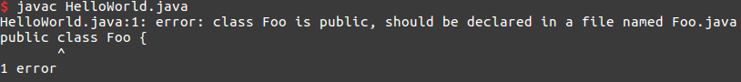

# Hello World!

Before we start... a bit of [trivia](https://en.wikipedia.org/wiki/%22Hello,_World!%22_program).

## Writing Your First Program

Copy and paste the following code into a new java file named `HelloWorld.java`. Save, exit, compile, and run/execute. What do you see?

```java
public class HelloWorld {
    public static void main( String[] args ) {
        System.out.println("Hello world!");
    }
}
```

If you have successfully compiled and run your program, you should see something like:


If you're having trouble with this part, check out the section below for potential messups or download [this](assets/HelloWorld.java) file.

### Important Notes

So what does all this code mean?

### Mystery #1

```java
public class HelloWorld {
    // code goes here
}
```

All java files must begin with `public class <File>`. Notice a similarity between the word after `class` in the above code block and the file name you were instructed to use? That's right, they're the same. The `<File>` part of the first line __MUST__ be the same as the filename without the `.java` extension. In other words, if the filename was `foo.java`, the first line has to be `public class foo {`. Ignore the `public class` for now, we'll get back to that in a later lesson.

There is a [convention](https://en.wikipedia.org/wiki/Coding_conventions) in java to use CamelCased filenames, which means that your `<File>` subsequently has to be CamelCased. CamelCasing refers to the CapitalizationOfTheFirstLetterOfEveryWordWithoutSpaces.

Follow conventions and don't be this guy:


_Related_: Seeing this error?



Make sure the filename and `<File>` are the same.

### Mystery #2

Looking at the code inside the outermost set of curly braces:

```java
    public static void main( String[] args ) {
        // all of your code should go here
    }
```

This is referred to as a specific type of function called __method__. We'll go over what functions and methods are later on in this course.

__This specific method is called the main method, and only the code inside this method will be run.__ Code outside this method serve to assist the code inside this method. Continuing with the example above, `System.out.println("Hello world!");` is the only code that is inside this method, and it's the only code that is run. If you put this line after the closing curly brace, you would not get an output when you run the program. (In fact, you'd get an error.)

### Mystery #3

By now, you've probably figured out the purpose of the following line.

```java
System.out.println("Hello world!");
```

When you want your program to print something, simply add this line to your main method and replace the characters inside the quotes with what you want to print. The quotes are important--make sure to keep them around your printed statement.

Note the semicolon at the end of the line. Inside any method, including the main method, all of your lines must end with semicolons. This tells the java compiler where the ends of your commands are. If you forget a semicolon, you will be gently reminded by the compiler.

## Syntax

We briefly touched upon this in the above section, but __syntax__ refers to a general set of rules for writing code in a specific language. For example, the semicolon rule above applies to code written in Java (this can be different in other languages, like Python). Whenever you're writing code, make sure to keep the syntax rules in mind.

## Assignment

Make a new java file and have it print out whatever you'd like. Use the code from the beginning of this section as a guide. Be careful of the common pitfalls we've covered in this and the previous lesson!
