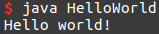

# Hello World!

Before we start... a bit of [trivia](https://en.wikipedia.org/wiki/%22Hello,_World!%22_program).

## Writing Your First Program

Copy and paste the following code into your newly created java file. Save, exit, compile, and run/execute. What do you see?

```java
public class HelloWorld {
    public static void main( String[] args ) {
        System.out.println("Hello world!");
    }
}
```

If you have successfully compiled and run your program, you should see something like:



If you're having trouble with this part, check out the section below for potential messups or download [this](assets/HelloWorld.java) file.

### Important Notes

So what does all this code mean?

...

If you are seeing this error,
