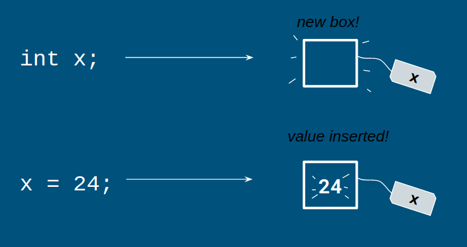

# Variables

Let's say you wanted to print out a really long word a bunch of times. Typing out (or even copy and pasting) this word would take a lot of time. How can we simplify this process?

Let's look at the following code.

```java
System.out.println("abracadabraabracadabraabracadabraabracadabraabracadabra");
System.out.println("abracadabraabracadabraabracadabraabracadabraabracadabra");
System.out.println("abracadabraabracadabraabracadabraabracadabraabracadabra");
```

vs

```java
String s = "abracadabraabracadabraabracadabraabracadabraabracadabra";
System.out.println(s);
System.out.println(s);
System.out.println(s);
```

Both code snippets, put inside the main method, will yield the same output. However, one is obviously shorter and easier to type than the other.

In the second code snippet, we're utilizing what's called a __variable__. Variables are containers used to store data. In this case, the data is a "string" of characters. More on that later.

## Data Types

In Java, it's necessary, when creating a variable, to give it a __type__. As we saw before, a "string" of characters is given a type of "String" __(capitalization is important)__.

Here are the other types:

| Data Type   | Data Stored     | Range           | Size    |
|-------------|-----------------|-----------------|---------|
| byte        | integer         | -128 to 127     | 8 bits  |
| short       | integer         | -32768 to 32767 | 16 bits |
| __int__     | integer         | -2^31 to 2^31-1 | 32 bits |
| long        | integer         | -2^63 to 2^63-1 | 64 bits |
| float       | floating point  | n/a             | 32 bits |
| __double__  | floating point  | n/a             | 64 bits |
| __boolean__ | true/false      | n/a             | n/a     |
| char        | character ('a') | n/a             | 16 bits |

[What's a floating point number?](https://techterms.com/definition/floatingpoint)

Don't worry about memorizing this, you can reference this table or documentation if you're unsure of what data is stored in each of the different types.

## Using a Variable

1. __Declare__ it (give it a type and name).

```java
int x;
```

2. Give it a value (this can be done in the same line as the declaration).

```java
x = 1;
```

or

```java
int x = 1;
```

Both of these lines sets a variable, named x, to the value `1`.

Booleans are a special case: they can only be assigned values of `true` or `false`.

```java
boolean a = true;
```

### Box Analogy

If you're having trouble visualizing this, try using the box analogy (credit FRC SE).



> When you create a variable, you’re creating a box with a name attached to it (you’re "reserving" a place on the computer to store information). When you assign a value to the variable, you’re changing what’s in the box.

### Strings

But wait, what about Strings?

Strings are just combinations or characters; they're what you think of as words, phrases, and sentences.

Strings are different from the data types in the table above. The data types in the table are __primitives__, the basic data types used in Java. However, Strings are declared and used in the same way that primitives are used.

```java
String whoAmI = "Ryan";
```

This creates a String called `whoAmI`, with a value of `Ryan`.

## Conventions

Like file names, variable names should be camelCased. However, __the first letter of the variable should not be capitalized__, unlike file names. For example, `variableName` would be an acceptable variable name, while `VariableName` and `variablename` are not acceptable.
