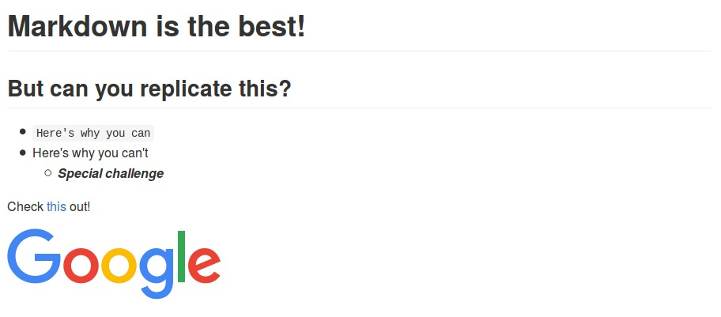

# Practice

You've made it to the final lesson in this course! Let's see what you've learned.

## Practice 0

Replicate the following page.

[Answer](assets/practice0.md)

## Practice 1

Create a markdown page for the fission310.github.io repository! Make sure to include a description of the website, how it was made (_hint: jekyll_), and what it's used for.

## Practice 2

Check out the useful, but less-used markdown elements, such as tables, blockquotes, inline HTML, and horizontal rules. Create a markdown page featuring each of these elements!
